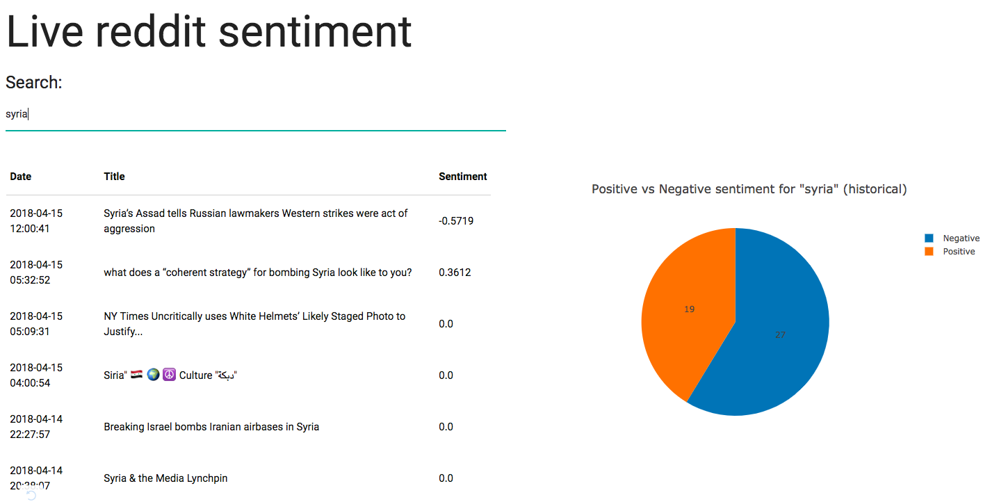

# Live reddit sentiment

## Redis caching
Run the following commands:
- build the required image: `docker build -t my-redis ./redis`
- run the container: `docker run -p 6379:6379 --name redis my-redis`

In production, nevigate the `redis.conf` file in the `redis` directory and modify variable as needed especially set the **protected-mode** to yes.

## MySQL database
To use msyql as the back end database, `cd` to the mysql directory and run:  
`docker-compose up -d`  
Change the mysql env variable respectively in the `docker-compose.yml` file.

## scripts to run
1. run `python reddit_streaming.py` 
2. run `python visualize.py`

## pre requirements
in mac:
- `brew install mysql` to get rid of `mysql_config` missing error
- then run `pip install mysqlclient` to install the python mysql driver
- modify the `praw.ini` file accordingly

___
# Implemented features
- able to stream reddit data
- cache top n reddit in redis
- sentiment pie chart

___
# To do
- For certain sentiment term, provision the most related words for that term.
- hot topic people are talking about
- ......

**Please create an issue to help me figure out what other features could be added to this product.**
___
# Credits
Thanks for [**Sentdex**](https://github.com/Sentdex) who gave the tutorial about how to use dash and help me build up my very first data visualization app with just some simple work.
